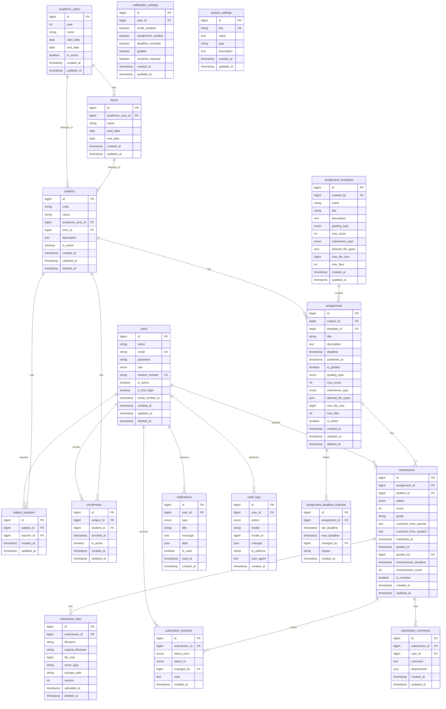

# 学校提出物管理アプリ ER図

## Mermaid形式のER図

---

## テーブル詳細説明

### users（ユーザー）

全てのユーザー（管理者、教員、学生）を管理するテーブル。

**主要カラム**:
- `role`: admin（管理者）、teacher（教員）、student_admin（管理者学生）、student（一般学生）
- `student_number`: 学生の場合のみ必須
- `is_active`: 論理削除フラグ
- `is_first_login`: 初回ログインフラグ（パスワード変更強制用）

**インデックス**:
- `email` (UNIQUE)
- `student_number` (UNIQUE)
- `role`

---

### academic_years（年度）

学年度を管理するテーブル。

**主要カラム**:
- `year`: 年度（例: 2024）
- `is_active`: 現在の年度かどうか

**インデックス**:
- `year` (UNIQUE)
- `is_active`

---

### terms（学期）

学期（前期、後期など）を管理するテーブル。

**主要カラム**:
- `academic_year_id`: 年度への外部キー
- `name`: 学期名（例: 前期、後期）

**インデックス**:
- `academic_year_id`

---

### subjects（科目）

科目情報を管理するテーブル。

**主要カラム**:
- `code`: 科目コード（例: CS101）
- `academic_year_id`: 年度への外部キー
- `term_id`: 学期への外部キー
- `is_active`: 論理削除フラグ

**インデックス**:
- `code, academic_year_id` (UNIQUE複合)
- `academic_year_id`
- `term_id`
- `is_active`

---

### subject_teachers（科目担当教員）

科目と教員の多対多リレーション中間テーブル。

**主要カラム**:
- `subject_id`: 科目への外部キー
- `teacher_id`: 教員（users）への外部キー

**インデックス**:
- `subject_id, teacher_id` (UNIQUE複合)
- `teacher_id`

---

### enrollments（履修）

学生と科目の履修関係を管理するテーブル。

**主要カラム**:
- `subject_id`: 科目への外部キー
- `student_id`: 学生（users）への外部キー
- `is_active`: 履修中かどうか

**インデックス**:
- `subject_id, student_id` (UNIQUE複合)
- `student_id`
- `is_active`

---

### assignments（提出物）

課題・提出物を管理するテーブル。

**主要カラム**:
- `subject_id`: 科目への外部キー
- `template_id`: テンプレートへの外部キー（任意）
- `grading_type`: score（点数）、grade（評価）
- `submission_type`: file（ファイル）、text（テキスト）、both（両方）
- `is_active`: 論理削除フラグ

**インデックス**:
- `subject_id`
- `deadline`
- `published_at`
- `is_active`

---

### assignment_templates（提出物テンプレート）

提出物のテンプレートを管理するテーブル。

**主要カラム**:
- `created_by`: 作成者への外部キー
- `name`: テンプレート名

**インデックス**:
- `created_by`

---

### assignment_deadline_histories（提出期限変更履歴）

提出期限の変更履歴を記録するテーブル。

**主要カラム**:
- `assignment_id`: 提出物への外部キー
- `old_deadline`: 変更前の期限
- `new_deadline`: 変更後の期限
- `changed_by`: 変更者への外部キー

**インデックス**:
- `assignment_id`
- `created_at`

---

### submissions（提出状況）

学生の提出状況を管理するテーブル。

**主要カラム**:
- `assignment_id`: 提出物への外部キー
- `student_id`: 学生への外部キー
- `status`: not_submitted（未提出）、submitted（提出済み）、graded（採点済み）、resubmit_required（再提出待ち）、resubmitted（再提出済み）
- `score`: 点数（grading_typeがscoreの場合）
- `grade`: 評価（grading_typeがgradeの場合）
- `graded_by`: 採点者への外部キー
- `is_overdue`: 期限超過フラグ

**インデックス**:
- `assignment_id, student_id` (UNIQUE複合)
- `student_id`
- `status`
- `submitted_at`
- `graded_at`

---

### submission_files（提出ファイル）

提出されたファイルを管理するテーブル。

**主要カラム**:
- `submission_id`: 提出状況への外部キー
- `version`: ファイルバージョン（再提出対応）
- `storage_path`: ストレージ上のパス

**インデックス**:
- `submission_id`
- `version`
- `deleted_at`

---

### submission_histories（提出状況変更履歴）

提出状況の変更履歴を記録するテーブル（監査用）。

**主要カラム**:
- `submission_id`: 提出状況への外部キー
- `status_from`: 変更前の状態
- `status_to`: 変更後の状態
- `changed_by`: 変更者への外部キー

**インデックス**:
- `submission_id`
- `changed_by`
- `created_at`

---

### submission_comments（提出物コメント）

提出物に対するコメントを管理するテーブル。

**主要カラム**:
- `submission_id`: 提出状況への外部キー
- `user_id`: コメント投稿者への外部キー
- `attachments`: 添付ファイル情報（JSON）

**インデックス**:
- `submission_id`
- `user_id`
- `created_at`

---

### notifications（通知）

ユーザーへの通知を管理するテーブル。

**主要カラム**:
- `user_id`: 通知先ユーザーへの外部キー
- `type`: assignment_created、deadline_reminder、graded、resubmit_required等
- `data`: 通知に関連するデータ（JSON）
- `is_read`: 既読フラグ

**インデックス**:
- `user_id`
- `is_read`
- `created_at`

---

### notification_settings（通知設定）

ユーザーごとの通知設定を管理するテーブル。

**主要カラム**:
- `user_id`: ユーザーへの外部キー（UNIQUE）
- 各種通知のON/OFFフラグ

**インデックス**:
- `user_id` (UNIQUE)

---

### audit_logs（監査ログ）

システム内の重要な操作を記録するテーブル。

**主要カラム**:
- `user_id`: 操作者への外部キー
- `action`: create、update、delete
- `model`: 操作対象のモデル名
- `model_id`: 操作対象のID
- `changes`: 変更内容（JSON）

**インデックス**:
- `user_id`
- `action`
- `model`
- `created_at`

**注意**: このテーブルは削除不可（改ざん防止）

---

### system_settings（システム設定）

システム全体の設定を管理するテーブル。

**主要カラム**:
- `key`: 設定キー（UNIQUE）
- `value`: 設定値
- `type`: 値の型（string、int、boolean等）

**インデックス**:
- `key` (UNIQUE)

---

## リレーションシップ詳細

### 1:N (One to Many) リレーション

- `academic_years` 1 : N `terms`
- `academic_years` 1 : N `subjects`
- `terms` 1 : N `subjects`
- `subjects` 1 : N `assignments`
- `subjects` 1 : N `enrollments`
- `assignments` 1 : N `submissions`
- `submissions` 1 : N `submission_files`
- `submissions` 1 : N `submission_histories`
- `submissions` 1 : N `submission_comments`
- `users` 1 : N `submissions`
- `users` 1 : N `notifications`
- `users` 1 : N `audit_logs`
- `assignment_templates` 1 : N `assignments`

### N:M (Many to Many) リレーション

- `subjects` N : M `users` (through `subject_teachers`)
  - 科目は複数の教員を持ち、教員は複数の科目を担当する
- `subjects` N : M `users` (through `enrollments`)
  - 科目は複数の学生を持ち、学生は複数の科目を履修する

---

## データ整合性制約

### UNIQUE制約

- `users.email`
- `users.student_number`
- `academic_years.year`
- `subjects.code + academic_year_id` (複合)
- `subject_teachers.subject_id + teacher_id` (複合)
- `enrollments.subject_id + student_id` (複合)
- `submissions.assignment_id + student_id` (複合)
- `notification_settings.user_id`
- `system_settings.key`

### NOT NULL制約

主要な必須フィールドには NOT NULL 制約を設定。

### CHECK制約

- `submissions.score`: 0 以上 assignments.max_score 以下
- `submission_files.file_size`: 0 より大きい
- `users.role`: 定義されたENUM値のみ

### 外部キー制約

全ての `_id` カラムには外部キー制約を設定し、参照整合性を保証。

**ON DELETE 設定**:
- `CASCADE`: submission_files, submission_histories（親削除時に子も削除）
- `RESTRICT`: 重要なリレーション（削除前に子の削除が必要）
- `SET NULL`: 任意のリレーション

---

## 論理削除（Soft Delete）

以下のテーブルには `deleted_at` カラムを設け、論理削除を実装：

- `users`
- `subjects`
- `assignments`
- `submission_files`

物理削除を行わないことで、履歴とデータの整合性を保持。

---

## インデックス戦略

パフォーマンス向上のため、以下のカラムにインデックスを作成：

1. **主キー**: 全テーブル（自動）
2. **外部キー**: 全ての `_id` カラム
3. **検索頻度の高いカラム**: 
   - `users.email`, `users.role`, `users.student_number`
   - `subjects.code`, `subjects.is_active`
   - `assignments.deadline`, `assignments.is_active`
   - `submissions.status`, `submissions.submitted_at`
   - `notifications.is_read`
4. **複合インデックス**:
   - `(subject_id, student_id)` on enrollments
   - `(assignment_id, student_id)` on submissions
   - `(user_id, is_read)` on notifications

---

## セキュリティ考慮事項

1. **パスワード**: bcryptでハッシュ化して保存
2. **個人情報**: 必要に応じて暗号化
3. **監査ログ**: 改ざん不可（削除・更新禁止）
4. **論理削除**: 物理削除は最小限に
5. **外部キー制約**: データ整合性の保証

---

## パフォーマンス考慮事項

1. **インデックス**: 検索頻度の高いカラムにインデックス作成
2. **ページネーション**: 大量データの一覧取得時は必須
3. **Eager Loading**: N+1問題の回避
4. **キャッシュ**: 頻繁にアクセスされるマスタデータはRedisでキャッシュ
5. **パーティショニング**: 将来的に audit_logs テーブルは年度別にパーティション化を検討

---

## 拡張性考慮事項

1. **JSON型の活用**: 柔軟なデータ構造が必要な場合（notifications.data等）
2. **バージョニング**: submission_files.version でファイル履歴管理
3. **テンプレート機能**: assignment_templates で再利用性向上
4. **設定の外部化**: system_settings で動的な設定変更

---

## 変更履歴

| 日付 | バージョン | 変更内容 |
|------|-----------|---------|
| 2024-04-15 | 1.0.0 | 初版作成 |
