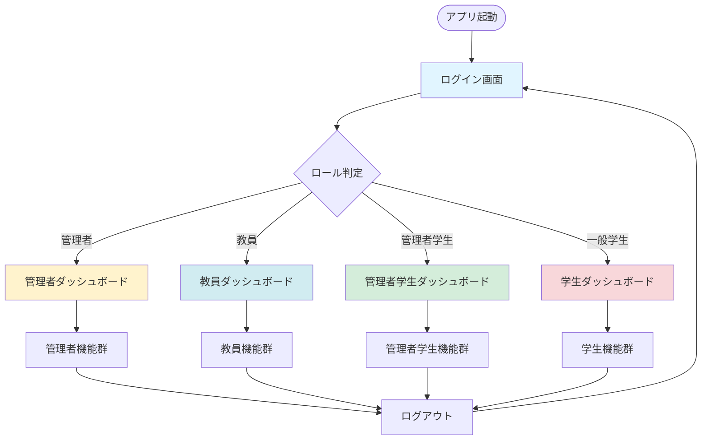
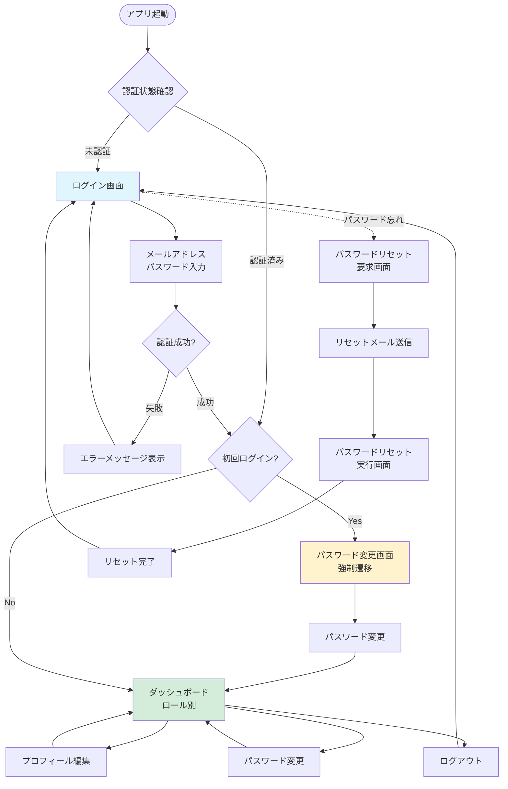
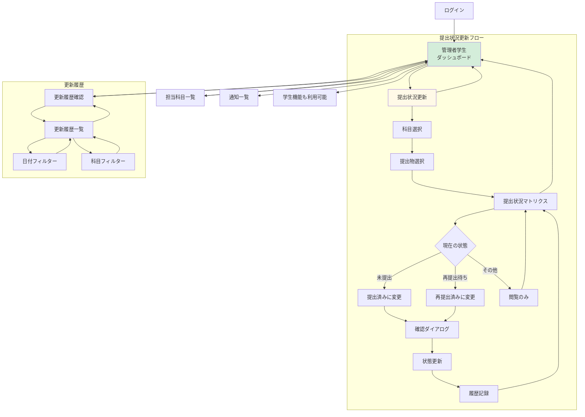
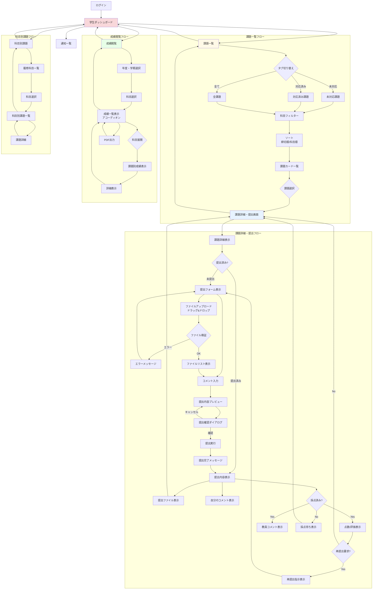
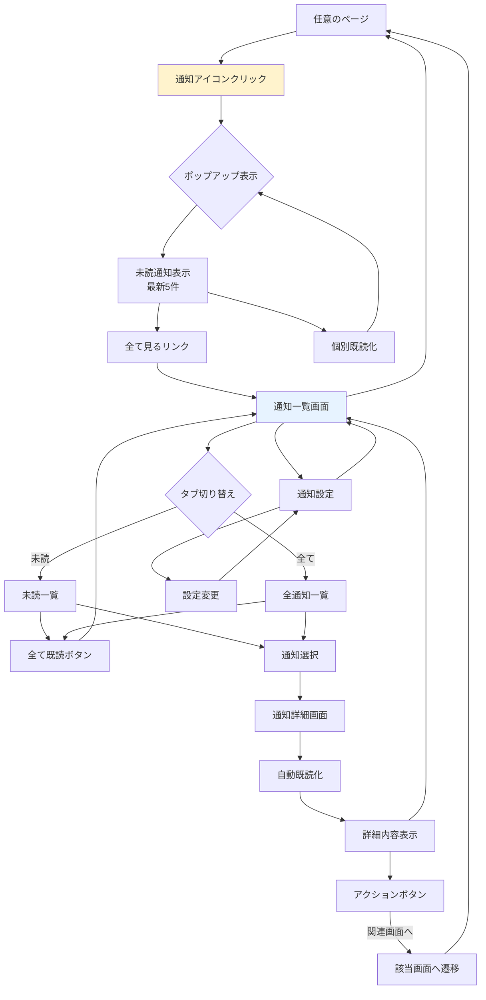
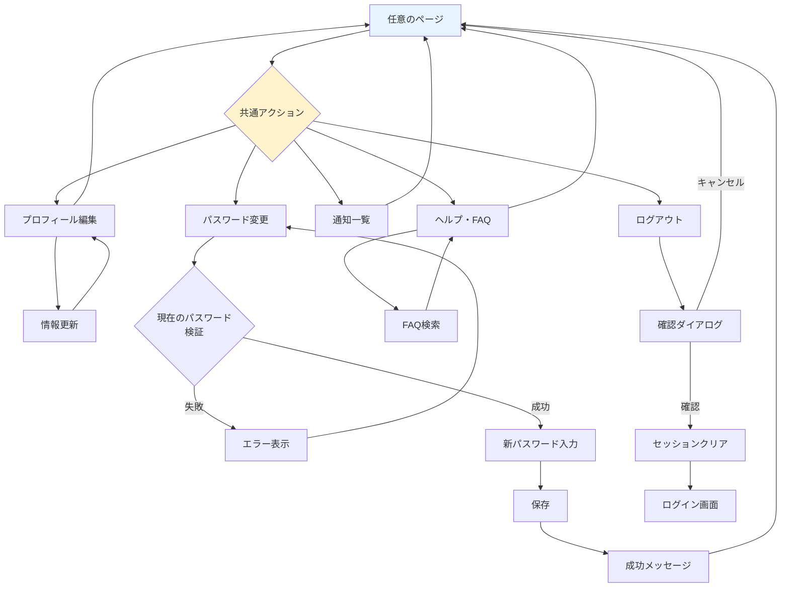
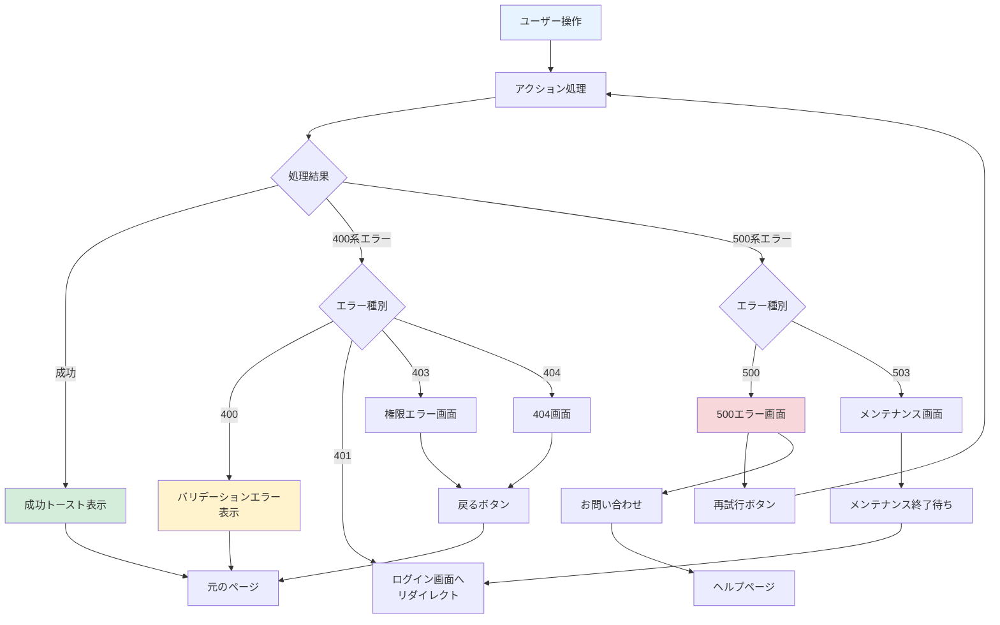
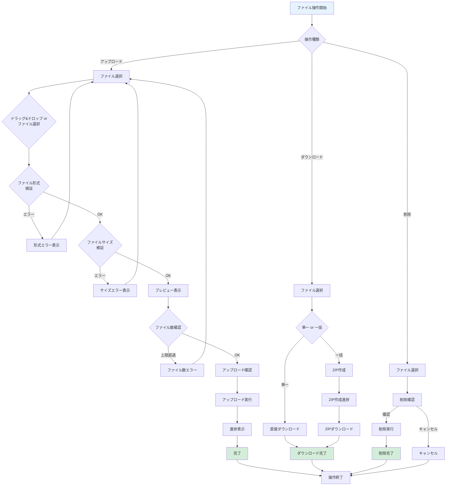

# 学校提出物管理アプリ 画面遷移図

## 目次

1. [全体遷移図](#1-全体遷移図)
2. [認証フロー](#2-認証フロー)
3. [管理者フロー](#3-管理者フロー)
4. [教員フロー](#4-教員フロー)
5. [管理者学生フロー](#5-管理者学生フロー)
6. [一般学生フロー](#6-一般学生フロー)

---

## 1. 全体遷移図

---

## 2. 認証フロー

---

## 3. 管理者フロー

```mermaid
graph TB
    Login[ログイン] --> AdminDash[管理者ダッシュボード]
    
    AdminDash --> UserMgmt[ユーザー管理]
    AdminDash --> AcademicMgmt[年度・学期管理]
    AdminDash --> SystemSettings[システム設定]
    AdminDash --> BackupMgmt[バックアップ管理]
    AdminDash --> AuditLog[監査ログ]
    AdminDash --> DataImport[データインポート]
    AdminDash --> TeacherFeatures[教員機能も利用可能]
    
    subgraph "ユーザー管理"
        UserMgmt --> UserList[ユーザー一覧]
        UserList --> UserCreate[新規登録]
        UserList --> UserEdit[編集]
        UserList --> UserDeactivate[無効化]
        UserCreate --> UserList
        UserEdit --> UserList
        UserDeactivate --> UserList
    end
    
    subgraph "年度・学期管理"
        AcademicMgmt --> YearMgmt[年度管理]
        YearMgmt --> YearCreate[年度作成]
        YearMgmt --> YearEdit[年度編集]
        YearMgmt --> YearSwitch[年度切替]
        
        AcademicMgmt --> TermMgmt[学期管理]
        TermMgmt --> TermCreate[学期作成]
        TermMgmt --> TermEdit[学期編集]
        
        YearCreate --> YearMgmt
        YearEdit --> YearMgmt
        TermCreate --> TermMgmt
        TermEdit --> TermMgmt
    end
    
    subgraph "システム設定"
        SystemSettings --> MailSettings[メール設定]
        SystemSettings --> NotifSettings[通知設定]
        SystemSettings --> FileSettings[ファイル設定]
        SystemSettings --> SecuritySettings[セキュリティ設定]
        
        MailSettings --> TestSend[テスト送信]
        TestSend --> MailSettings
        
        MailSettings --> SystemSettings
        NotifSettings --> SystemSettings
        FileSettings --> SystemSettings
        SecuritySettings --> SystemSettings
    end
    
    subgraph "バックアップ"
        BackupMgmt --> BackupList[バックアップ一覧]
        BackupList --> ManualBackup[手動バックアップ実行]
        BackupList --> Download[ダウンロード]
        BackupList --> Delete[削除]
        
        ManualBackup --> BackupList
        Download --> BackupList
        Delete --> BackupList
    end
    
    subgraph "監査ログ"
        AuditLog --> LogList[ログ一覧]
        LogList --> LogDetail[ログ詳細]
        LogList --> LogExport[CSV出力]
        
        LogDetail --> LogList
        LogExport --> LogList
    end
    
    subgraph "データインポート"
        DataImport --> SelectType[対象選択]
        SelectType --> UploadCSV[CSVアップロード]
        UploadCSV --> Preview[プレビュー]
        Preview --> Execute[インポート実行]
        Execute --> Result[結果表示]
        Result --> DataImport
    end
    
    UserMgmt --> AdminDash
    AcademicMgmt --> AdminDash
    SystemSettings --> AdminDash
    BackupMgmt --> AdminDash
    AuditLog --> AdminDash
    DataImport --> AdminDash
    
    style AdminDash fill:#fff3cd
    style UserMgmt fill:#e7f3ff
    style SystemSettings fill:#ffe7e7
```

---

## 4. 教員フロー

```mermaid
graph TB
    Login[ログイン] --> TeacherDash[教員ダッシュボード]
    
    TeacherDash --> SubjectMgmt[科目管理]
    TeacherDash --> AssignmentMgmt[提出物管理]
    TeacherDash --> Grading[採点]
    TeacherDash --> Reports[レポート出力]
    TeacherDash --> Notifications[通知一覧]
    
    subgraph "科目管理フロー"
        SubjectMgmt --> SubjectList[科目一覧]
        SubjectList --> SubjectCreate[科目作成<br/>管理者のみ]
        SubjectList --> SubjectEdit[科目編集<br/>担当教員]
        SubjectList --> EnrollmentMgmt[履修管理]
        
        SubjectCreate --> SubjectList
        SubjectEdit --> SubjectList
        
        EnrollmentMgmt --> EnrollList[履修学生一覧]
        EnrollList --> EnrollAdd[履修登録]
        EnrollList --> EnrollRemove[履修解除]
        EnrollList --> EnrollImport[CSVインポート]
        EnrollList --> EnrollExport[CSV出力]
        
        EnrollAdd --> EnrollList
        EnrollRemove --> EnrollList
        EnrollImport --> EnrollList
        EnrollExport --> EnrollList
        EnrollList --> SubjectList
    end
    
    subgraph "提出物管理フロー"
        AssignmentMgmt --> AssignList[提出物一覧]
        AssignList --> AssignCreate[提出物作成]
        AssignList --> AssignEdit[提出物編集]
        AssignList --> TemplateUse[テンプレートから作成]
        AssignList --> SubmissionMatrix[提出状況マトリクス]
        
        AssignCreate --> AssignList
        AssignEdit --> AssignList
        TemplateUse --> AssignList
        
        SubmissionMatrix --> SubmDetail[提出物詳細]
        SubmDetail --> GradeForm[採点フォーム]
        SubmDetail --> ResubmitReq[再提出指示]
        SubmDetail --> FileDownload[ファイルダウンロード]
        
        GradeForm --> SubmDetail
        ResubmitReq --> SubmDetail
        FileDownload --> SubmDetail
        SubmDetail --> SubmissionMatrix
        SubmissionMatrix --> AssignList
    end
    
    subgraph "テンプレート管理"
        AssignmentMgmt --> TemplateList[テンプレート一覧]
        TemplateList --> TemplateCreate[テンプレート作成]
        TemplateList --> TemplateEdit[テンプレート編集]
        TemplateList --> TemplateDelete[テンプレート削除]
        
        TemplateCreate --> TemplateList
        TemplateEdit --> TemplateList
        TemplateDelete --> TemplateList
    end
    
    subgraph "採点フロー"
        Grading --> GradingList[未採点一覧]
        GradingList --> GradingDetail[採点画面]
        GradingDetail --> InputGrade[点数/評価入力]
        GradingDetail --> InputComment[コメント入力]
        InputGrade --> SaveGrade[採点保存]
        InputComment --> SaveGrade
        SaveGrade --> NextStudent{次の学生へ}
        NextStudent -->|続ける| GradingDetail
        NextStudent -->|終了| GradingList
        GradingList --> Grading
    end
    
    subgraph "レポート出力"
        Reports --> SelectReport[レポート種類選択]
        SelectReport --> SetCondition[出力条件設定]
        SetCondition --> SelectFormat[形式選択<br/>CSV/Excel/PDF]
        SelectFormat --> Export[出力実行]
        Export --> Reports
    end
    
    SubjectMgmt --> TeacherDash
    AssignmentMgmt --> TeacherDash
    Grading --> TeacherDash
    Reports --> TeacherDash
    
    style TeacherDash fill:#d1ecf1
    style SubjectMgmt fill:#e7f3ff
    style AssignmentMgmt fill:#fff9e7
    style Grading fill:#ffe7f0
```

---

## 5. 管理者学生フロー

---

## 6. 一般学生フロー

---

## 7. 通知フロー（全ロール共通）

---

## 8. 共通アクション遷移

---

## 9. エラーハンドリング遷移

---

## 10. ファイル操作フロー

---

## 変更履歴

| 日付 | バージョン | 変更内容 |
|------|-----------|---------|
| 2024-04-15 | 1.0.0 | 初版作成 |
